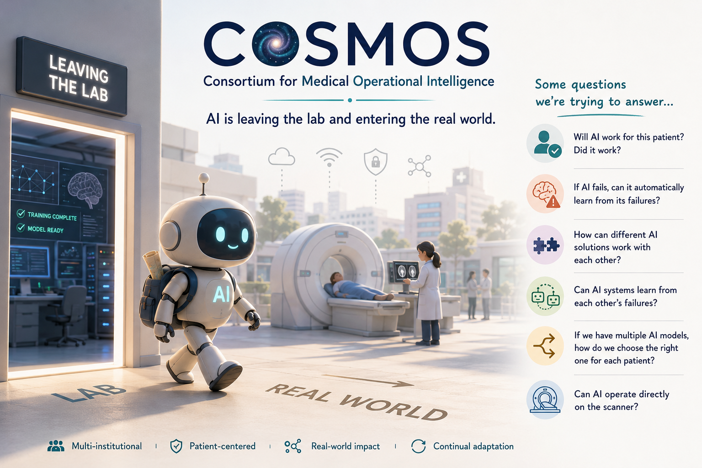
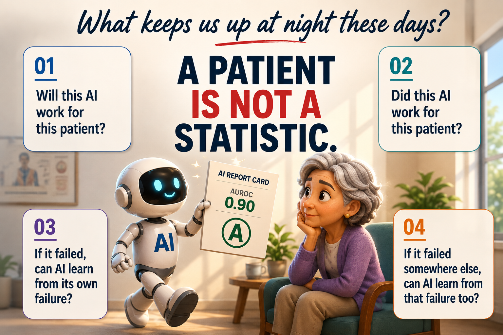

# COSMOS Landing Page

Static landing page package for **COSMOS — Consortium for Medical Operational Intelligence**.

## Files

- `index.html` — page structure/content
- `styles.css` — responsive visual styling
- `script.js` — mobile nav, Publications/Grants tabs, reveal effects
- `assets/cosmos-hero.png` — current hero visual
- `assets/current-question.png` — current “What keeps us up at night?” visual

## Quick edits

### Replace images
Update these paths in `index.html`:

```html


```

You can replace the files in `/assets` without changing HTML if you keep the same filenames.

### Publications and grants
Search `index.html` for `Publication title goes here` and `Funded project title goes here`.

### Team
Replace placeholder initials, names, roles, and institutions. For real team photos, replace:

```html
<div class="avatar placeholder-avatar">VP</div>
```

with:

```html
<div class="avatar"></div>
```

### Collaborate link
Replace `your-email@institution.edu` in the mailto link.

## Preview locally

Open `index.html` directly, or run:

```bash
python3 -m http.server 8000
```

Then visit `http://localhost:8000`.

## Notes

The page intentionally avoids “research areas” or “pillars.” COSMOS is presented as one umbrella — **Operational Intelligence** — with a living current question, recent work, team, and collaboration path.
